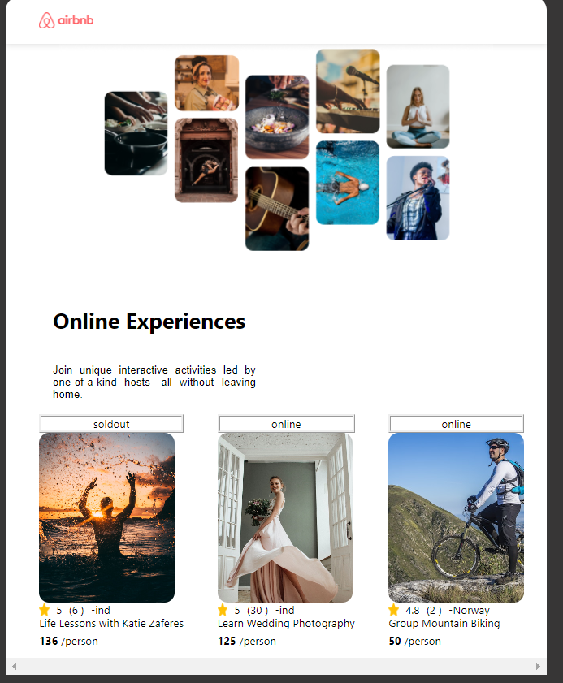

# Airbnd experince clone

about 
- this is  class project from scrimba react course

- this is simple airbnd experince website clone 

what i learned

- props
- how pass data through props
- conditional rendering
- how to map through  arry of  data and 
  send it to props
- reusable components

images

